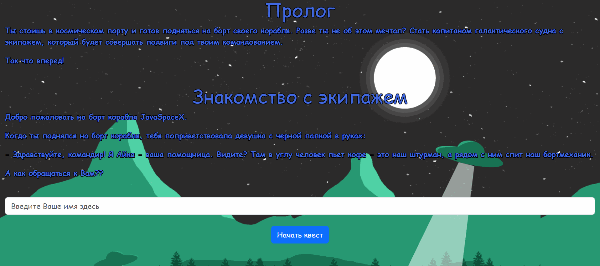

# Игра "Квест"

### Описание
____
**Это текстовая квест-игра, в которой необходимо правильно отвечать на вопросы, чтобы дойти до конца и победить. При прохождении игры доступна кнопка статистики, которая отображает имя, введенное вами перед началом прохождения игры, и количество прохождений Вами этой игры независимо от побед и поражений. Также есть возможность начать игру заново.**

### Инструменты
____
***Игра создана с помощью следующих технологий:***

```
- Intellij IDEA
- Maven
- Java version 18.0.1
- TomCat 10.1.12
- JSP
- JSTL
- HTML
- CSS
- Bootstrap
- JUnit5 
```

### Инструкция для запуска
1. Необходимо сделать `fork` этого репозитория.
2. Затем сделайте `clone` этого проекта.
3. Открыть этот проект в среде разработки.
4. Настроить проект в соответствии с указанными выше технологиями для корректного запуска.


